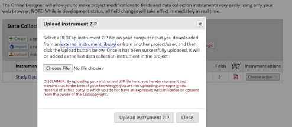
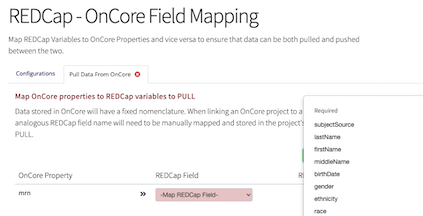
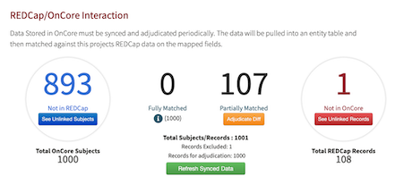

# OnCoreIntegration

** **Note: Minimum Compatibile OnCore API verion is 2021R3** **

Many institutions use the OnCore system by Advarra to manage their clinical trials and also use REDCap to capture and store
participant data. Linking these two systems, by automating the transfer of participants between the two systems,
will increase efficiency and reduce errors.
This REDCap External Module (EM) automates the transfer of participant data in a study between REDCap to OnCore.

This EM will periodically scan REDCap projects to see if an IRB number is entered into the Project Settings page.
When entered, then OnCore will be scanned for protocols that have the same IRB number.
If a match is found, an option to link the 2 projects will be presented to REDCap users so that Subject data can be
shared between the two. The data on the OnCore side will always be considered the "Source of Truth".

## External Module Systemwide Setup

Institutions using this Module will need to set up system level settings before allowing REDCap projects to enable it.
Below is a list of required configurations which must be entered into the EM System Settings page:

1. Base OnCore URL. e.g. `https://oncore.[INSTITUTIONS-NAME].edu`
2. OnCore API Auth URN to generate access tokens. e.g. `forte-platform-web/api/oauth/token`
3. OnCore API URN to get data from API. e.g `oncore-api/rest/`
4. Global OnCore API user client_id. Please refer to OnCore documentation on how to generate a client_id.
5. Global OnCore API user client_secret. Please refer to OnCore documentation on how to generate a client_secret.
6. JSON Object that defines OnCore fields properties.  [Link to example](#oncore-fields-definition-example)
    1. Note: The following fields are **required** by OnCore API and can NOT be empty or undefined.
        1. mrn
        2. gender
        3. ethnicity
        4. race
        5. birthDate
        6. lastName
        7. firstName
7. Define OnCore Protocol Staff that are allowed to Push REDCap record data to OnCore Protocol.
    1. The EM matches REDCap user with OnCore contact using username. **Please Note OnCore Contact API does not return
       Contact username.You MUST define REDCap username under AddtionalIds field**
8. Define OnCore Protocol statuses that are allowed to push to OnCore via API.
9. Define OnCore Protocol study sites you want REDCap users to pick from.

## Prerequisites and Limitations

This module uses the REDCap Entity API External Module developed by University of Florida so the Entity EM
must be enabled before this EM is enabled.

When using this module, there are a few items to be aware of:

1. Currently, you can only connect one instance of OnCore to this EM. If your institution uses multiple instances of OnCore,
you will need to choose which instance to connect.
2. Before the REDCap project/OnCore linkage can be made, the study must already be created in OnCore
3. Before being able to push data to OnCore, the OnCore study status must be in one of the allowed
statuses from 8 above.
4. Participants can only be transferred between systems for Per-Participant studies. Studies which are Summary Accural Only,
   are not supported.
5. When 'pushing' participants from REDCap to OnCore, the subject becomes associated with the study but their status is not put in the **OnStudy** state.
    Currently, the API does not support placing subjects "OnStudy" in OnCore so this step must be performed manually.
6. OnCore users cannot be OnCore admins.

## Setup

### Matching a REDCap project with an OnCore project
Each REDCap project that would like to use this functionality, must provide an IRB Number in the REDCap Project Setup page.


If a new REDCap project is being created and will be linked to OnCore, please see the section on <i>Using a project template for new REDCap projects</i>

Once the project is created, this OnCore Integration EM will need to be enabled on the project from a REDCap Administrator.  Once the EM is enabled, the project setup page will display a Link Project button.

### Linking REDCap to OnCore
The Link Project button will be provided on the Project Setup page as seen below.


Once the Link Project button is selected, the projects will be linked.


### Project Fields
REDCap subjects are linked to OnCore based on MRNs. In order to bring data from OnCore into your REDCap project, you must have an MRN field created in REDCap. Any additional data fields are optional.

If your project intends to push Subjects from your REDCap project to OnCore, below is the list of fields that are required by OnCore.  If your project does not store **ALL** the required fields, the data transfer will not be successful.
The required fields are:

    1. MRN
    2. First Name
    3. Middle Name
    4. Last Name
    5. Date of Birth
    6. Gender
    7. Race
    8. Ethnicity
    9. Study Site

### Using a project template for new REDCap projects
New REDCap projects, which intend to use the OnCore linkage, are created, users are encouraged to create the project using an OnCore template project.  The template
project should include all required fields needed to push data to OnCore. The Stanford OnCore Template xml file is provided in the EM if other institutions would like to use
it as a starting point. This template project can be modified based on each institution's particular OnCore setup.


Also included in the EM is a zip file with just the Stanford OnCore Demographics form which can be used with existing REDCap projects.  To use this template to create a
new form in your existing project, select the Upload option on the Online Designer page.



Once the form is included in a REDCap project, it can be changed based on project requirements.  For instance, if your research wants more granularity for the Race field and capture Native Hawaiian
and Other Pacific Islander into separate coded values, you can make that change in the form and map both options to the same OnCore value in the field mapping section.

### Using a form template for existing REDCap project
If you have an existing REDCap project and would like to include the templated Oncore Demographics form, a template .zip file is included
which creates all the required and optional fields that can be mapped to OnCore.  To use the templated form, go to the Online Designer and
use the Upload instrument zip file from another project/user


## Field Mapping
Once the OnCore and REDCap projects are linked, some initial configuration mapping is necessary. Generally, mapping is only performed once
but if the data you want stored from OnCore changes or the data you want to push to OnCore changes, you will need
to revisit the mapping page.

The Project Setup page has a link to the Field Mapping page:


Once the mapping is completed, further mapping updates will need to be performed using the link on the left-hand sidebar in the External Module section.
The link is called OnCore Field Mapping.


The Field Mapping page allows you to select the options to retrieve (pull) OnCore data and store it in your REDCap project and/or
push data from your REDCap project to OnCore.  You are also able to select the study sites you will use in your project.


### Data Mapping for Pulling OnCore Data
In order to `PULL` data from OnCore to REDCap, the participant's MRNs are required. The REDCap project MRN field needs to be mapped to the OnCore MRN field.
In addition to MRN, you may select the relevant OnCore Properties from the drop-down one by one, and select the appropriate REDCap field where that OnCore property will be saved.
If there are enumerated fields, a second level mapping field will appear so that the individual REDCap options can be mapped to the OnCore options.



### Data Mapping for Pushing REDCap data to OnCore
In order to `PUSH` Subject data from REDCap to OnCore, there is a **miniumum** set of fields required by mapping a core subset of OnCore Properties to their REDCap counterparts.
If the requirements are not met, the push will fail. The minimum set of fields is listed when you go to the <i>Push Data to OnCore</i> tab.


Not all required fields are shown in the picture above.

If there are other fields that you would like to push to OnCore, such as address, city, state, zip code, etc. select the <i>Show Optional OnCore Properties</i> button
to map additional Subject properties.

Once the Pull and Push mappings are complete, you can perform the Pull and Push sync actions.

## Perform a sync with OnCore

To find out which OnCore subjects are not in your new REDCap project, go to the Manual Sync link located in the left hand sidebar under External Modules.


This page will give an overview of the status of your REDCap and OnCore records.  To update your project, you may select the
<i>Refresh Synced Data</i> button to re-scan OnCore and refresh your status.



Once your project is refreshed, you can go to the <i>See Unlinked Subjects</i> button and/or the <i>See Unlinked Records</i> tab to adjudicate the subjects.

## Adjudication
The EM will take the mapping data and do a daily (or manual) scan/sync against the OnCore API using a subject's **MRN** to find matches.  If data is found it will be assigned 3 possible statuses; "Partial Match", "OnCore only", "REDCap only".

### Partial Match
The data was found in both the REDCap Project and its OnCore counterpart.  But there was a discrepency in one or more properties/fields.   In these instances, OnCore, being the "source of truth", will overwrite the data in the mapped REDCap field unless that subject is "excluded".

### OnCore Only
Subjects are found in the OnCore Protocol but no matching MRN was found in the REDCap project.  In this instance, all the subjects and their mapped data are pulled into REDCap from OnCore unless "excluded".

### REDCap Only
Subjects are found in the REDCap project but no matching MRN was found in the OnCore Protocol.  In this instance all the selected subjects and their mapped data are pushed into OnCore from REDCap unless "excluded".

**NOTE:** When pushing REDCap records to OnCore, the participant will be associated with the OnCore Protocol but will not have the status of OnStudy
since the current set of APIs do not support changing the status of the OnCore subject.  Therefore, REDCap users
must go into OnCore and change the status of each pushed participant to be OnStudy.

Until the status update is manually performed in OnCore, those participants will still be displayed as **Not in OnCore**.

## OnCore Fields Definition Example

```json
{
    "subjectDemographicsId": {
        "alias": "",
        "allow_default": "false",
        "description": "subject Demographics Id",
        "oncore_field_type": [
            "string"
        ],
        "oncore_valid_values": [],
        "required": "false"
    },
    "subjectSource": {
        "alias": "",
        "allow_default": "false",
        "description": "subject Source",
        "oncore_field_type": [
            "string"
        ],
        "oncore_valid_values": [],
        "required": "false"
    },
    "mrn": {
        "alias": "",
        "allow_default": "false",
        "description": "MRN",
        "oncore_field_type": [
            "string"
        ],
        "oncore_valid_values": [],
        "required": "true"
    },
    "lastName": {
        "alias": "",
        "allow_default": "false",
        "description": "last Name",
        "oncore_field_type": [
            "string"
        ],
        "oncore_valid_values": [],
        "required": "true"
    },
    "firstName": {
        "alias": "",
        "allow_default": "false",
        "description": "first Name",
        "oncore_field_type": [
            "string"
        ],
        "oncore_valid_values": [],
        "required": "true"
    },
    "middleName": {
        "alias": "",
        "allow_default": "false",
        "description": "middle Name",
        "oncore_field_type": [
            "string"
        ],
        "oncore_valid_values": [],
        "required": "false"
    },
    "suffix": {
        "alias": "",
        "allow_default": "false",
        "description": "suffix",
        "oncore_field_type": [
            "string"
        ],
        "oncore_valid_values": [],
        "required": "false"
    },
    "birthDate": {
        "alias": "",
        "allow_default": "false",
        "description": "Date of Birth",
        "oncore_field_type": [
            "string"
        ],
        "oncore_valid_values": [],
        "required": "true"
    },
    "approximateBirthDate": {
        "alias": "",
        "allow_default": "false",
        "description": "approximate Birth Date",
        "oncore_field_type": [
            "bool"
        ],
        "oncore_valid_values": [],
        "required": "false"
    },
    "birthDateNotAvailable": {
        "alias": "",
        "allow_default": "false",
        "description": "birth Date Not Available",
        "oncore_field_type": [
            "bool"
        ],
        "oncore_valid_values": [],
        "required": "false"
    },
    "expiredDate": {
        "alias": "",
        "allow_default": "false",
        "description": "expired Date",
        "oncore_field_type": [
            "string"
        ],
        "oncore_valid_values": [],
        "required": "false"
    },
    "approximateExpiredDate": {
        "alias": "",
        "allow_default": "false",
        "description": "approximate Expired Date",
        "oncore_field_type": [
            "bool"
        ],
        "oncore_valid_values": [],
        "required": "false"
    },
    "lastDateKnownAlive": {
        "alias": "",
        "allow_default": "false",
        "description": "last Date Known Alive",
        "oncore_field_type": [
            "string"
        ],
        "oncore_valid_values": [],
        "required": "false"
    },
    "ssn": {
        "alias": "",
        "allow_default": "false",
        "description": "Social Security Number",
        "oncore_field_type": [
            "string"
        ],
        "oncore_valid_values": [],
        "required": "false"
    },
    "gender": {
        "alias": "",
        "allow_default": "false",
        "description": "Gender",
        "oncore_field_type": [
            "string"
        ],
        "oncore_valid_values": [
            "Male",
            "Female",
            "Unknown"
        ],
        "required": "true"
    },
    "ethnicity": {
        "alias": "",
        "allow_default": "false",
        "description": "Ethnicity",
        "oncore_field_type": [
            "string"
        ],
        "oncore_valid_values": [
            "Hispanic or Latino",
            "Non-Hispanic",
            "NOTE - Use Unknown For Not Reported",
            "Unknown"
        ],
        "required": "true"
    },
    "race": {
        "alias": "",
        "allow_default": "false",
        "description": "Race",
        "oncore_field_type": [
            "array"
        ],
        "oncore_valid_values": [
            "White",
            "Black or African American",
            "Native Hawaiian or Other Pacific Islander",
            "Asian",
            "American Indian or Alaska Native",
            "Not Reported",
            "Unknown"
        ],
        "required": "true"
    },
    "subjectComments": {
        "alias": "",
        "allow_default": "false",
        "description": "subject Comments",
        "oncore_field_type": [
            "string"
        ],
        "oncore_valid_values": [],
        "required": "false"
    },
    "additionalSubjectIds": {
        "alias": "",
        "allow_default": "false",
        "description": "additional Subject Ids",
        "oncore_field_type": [
            "array"
        ],
        "oncore_valid_values": [],
        "required": "false"
    },
    "streetAddress": {
        "alias": "",
        "allow_default": "false",
        "description": "street Address",
        "oncore_field_type": [
            "string"
        ],
        "oncore_valid_values": [],
        "required": "false"
    },
    "addressLine2": {
        "alias": "",
        "allow_default": "false",
        "description": "address Line 2",
        "oncore_field_type": [
            "string"
        ],
        "oncore_valid_values": [],
        "required": "false"
    },
    "city": {
        "alias": "",
        "allow_default": "false",
        "description": "City",
        "oncore_field_type": [
            "string"
        ],
        "oncore_valid_values": [],
        "required": "false"
    },
    "state": {
        "alias": "",
        "allow_default": "false",
        "description": "State",
        "oncore_field_type": [
            "string"
        ],
        "oncore_valid_values": [],
        "required": "false"
    },
    "zip": {
        "alias": "",
        "allow_default": "false",
        "description": "ZIP",
        "oncore_field_type": [
            "string"
        ],
        "oncore_valid_values": [],
        "required": "false"
    },
    "county": {
        "alias": "",
        "allow_default": "false",
        "description": "County",
        "oncore_field_type": [
            "string"
        ],
        "oncore_valid_values": [],
        "required": "false"
    },
    "country": {
        "alias": "",
        "allow_default": "false",
        "description": "Country",
        "oncore_field_type": [
            "string"
        ],
        "oncore_valid_values": [],
        "required": "false"
    },
    "phoneNo": {
        "alias": "",
        "allow_default": "false",
        "description": "Phone",
        "oncore_field_type": [
            "string"
        ],
        "oncore_valid_values": [],
        "required": "false"
    },
    "alternatePhoneNo": {
        "alias": "",
        "allow_default": "false",
        "description": "alternate Phone",
        "oncore_field_type": [
            "string"
        ],
        "oncore_valid_values": [],
        "required": "false"
    },
    "email": {
        "alias": "",
        "allow_default": "false",
        "description": "Email",
        "oncore_field_type": [
            "string"
        ],
        "oncore_valid_values": [],
        "required": "false"
    }
}
```
# External Module Prerequisites
This module uses the REDCap Entity API External Module developed by University of Florida.
